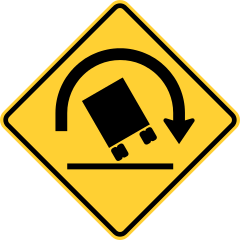

<p align="center"></p>

```
# build with profiling since the example will ask for
# stack trace with `GHC.Stack.currentCallStack`
stack build --trace
stack exec rollover-example -- my-server-api-token test deadbeef
```
